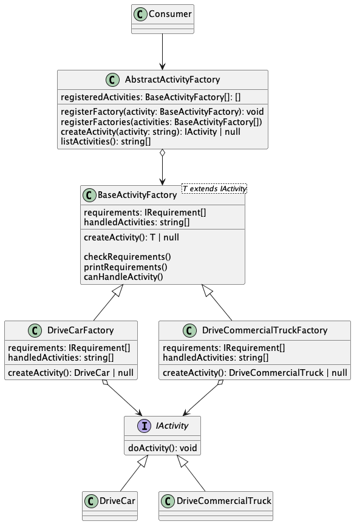

# Abstract Factory Pattern

## Overview
We learned while implementing the factory pattern how to abstract creation logic into a factory which is responsible for the nitty gritty details of the object construction. This was done to simplify the caller while ensuring conformity with the resulting activity objects.

While our solution is fine and more flexible than the original implementation, there are still limitations that will affect how useful the code is. For example, the factory needs to be modified whenever a new activity is added. This is better than before as it's a single place to update, but ideally we would have a system flexible enough to handle new types of objects without needing to modify anything outside of those objects. Consider the following scenario

## Example Scenario
Let's pretend we work at a vacation resort which offers a number of activities to the resorts guests. New activities can be added at any given point, each activity can have its own restrictions, and the construction of each activity might require additional logic that we don't want to bloat the factory with. This would quickly become an unmaintainable mess with the existing implementation as the ActivityFactory would need to handle all of the logic during the creation of the objects.

Let's see an example. The resort decided to add an activity where a guest can rent a car to drive a tour around the resort's location. This sounds simple, but now there are likely age restrictions that need to be taken into account. The guest may not know how to drive or can only drive certain types of vehicles (manual or automatic). There could even be health restrictions. When the guest is at the activity counter asking to do the rental activity, they won't know what these restrictions are ahead of time and the restrictions themselves can have variations. Maybe one of the rentals is a large truck that requires a CDL license to operate. In this case, the guest would need to be the right age, have a driving license, and have a CDL license on top of that. All the guest cares about, however, is whether they can do it and then they do the activity if possible.

In the above example, all activities are ultimately the same. They have a doActivity method which executes the activity. Their implementations and restrictions, however, are different. This means we have a group of related "things" with a common interface. This is where abstract factories shine: when you need to create groups or families of objects with a similar nature but potentially wildly-varying implementations and rules.

## Example Solution
In order to cleanly implement this activity system for the resort's guests, we want to isolate the individual activity logic to just that activity and provide a mechanism for creating these activities without knowing or caring about the actual individual logic. This is done by creating an abstraction above the individual factories, hence the name abstract factory.

Let's take a look at the base factory class for this solution:

```
export abstract class BaseActivityFactory<T extends IActivity> {
  abstract requirements: IRequirement[]
  abstract handledActivities: string[]
  abstract createActivity(): T | null

  checkRequirements = () => this.requirements.every(requirement => requirement.checkRequirement())
  printRequirements = () => this.requirements.forEach(x => terminal.info(` - ${x.description}`))
  canHandleActivity = (activityName: string) => this.handledActivities.includes(activityName)
}
```

You can see this base factory provides abstract properties and methods for the logic that is specific to individual activities while providing common methods for eligibility checks, requirements, and so forth. When we say eligibility checks, we mean which activities can be created by which factories. If an activity isn't handled by a given factory, that activity isn't eligible to request from said factory. We can then create concrete factories using this abstraction as demonstrated below:

```
export class DriveCarFactory extends BaseActivityFactory<DriveCar> {

    // The requirements associated with this activity
    requirements = [
        new AgeRequirement(16),
        new LicenseTypeRequirement(LicenseType.Passenger)
    ]

    // A lookup of which activities this factory can handle. Provides flexibility and allows factories themselves to behave like abstractions if needed since the factory uses these to determine eligibility
    handledActivities: string[] = [
        ActivityType.DriveCar
    ]

    // Main factory method for creating the activity handled by this factory
    createActivity(): DriveCar | null {
        // Note this automatically handles requirements and whatnot. 
        if (!this.checkRequirements()) {
            terminal.info('User did not meet requirements for the drive car activity')
            terminal.info('Requirements:')
            this.printRequirements()

            return null
        }

        return new DriveCar()
    }
}
```

We can see from the above example factory that the logic necessary to create the activity is encapsulated in its own factory and the abstract factory that sits above no longer needs to worry about creating the object. Instead, it checks for any registered factories that are eligible to create the activity and, if one is found, it invokes the factory to generate the object and return. Logic around requirements is no longer handled at the top level factory which simplifies the interfaces.

Additionally, with a factory for each type of activity (or group of activities if the handledActivities consists of multiple), the abstract factory is able to return which activities it supports. This allows the caller to not know or need to know which activities are available ahead of time. It instead allows the abstract factory to drive which activities are available

With the above abstract factory sitting above individual activity factories, the consumer can retrieve a list of registered activities and the consumer just passes the chosen activity in. Again, any additional logic or differences between activities are handled by the activity factory.

```
// Prompt user on which activity they want to do
	const chosenActivity = terminal.promptWithChoiceSync<string>(
		'Choose activity ',
		AbstractActivityFactory.listActivities(),
	)

	// Execute activity if it exists
	AbstractActivityFactory.createActivity(chosenActivity)?.doActivity()
```

With all of the above implemented, you can see the calling code doesn't need to know about any activities. It uses what the abstract factory tells it is available and then constructs the object through the factory.

The abstract factory itself is dynamic and can handle any new activity types are added as long as the activity conforms to the necessary interfaces and is registered.

## Implementation Details

