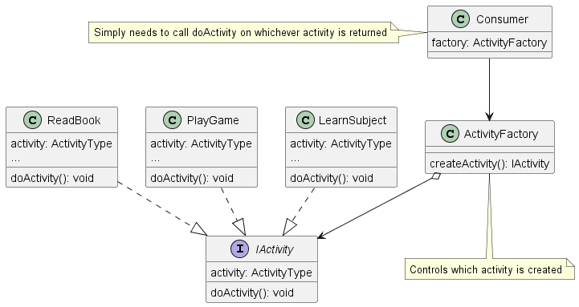

# Factory Method Pattern (aka Factory Pattern)

## Overview
The Factory design pattern sets out to help with the creation of related objects while hiding the implementation of those objects from the caller. This pattern is especially useful when you have many objects that need to be created but all have slightly different, but simple differences. For example, a factory could be used to create vehicles since all vehicles share certain functionality and use cases.

## Example Scenario
To demonstrate the pattern and the benefits it provides, consider an activity application that provides a user with different activities they can do. Each activity can be different but all activities are actionable (by doing the activity) and so we can design a factory that is extensible and can handle a variety of activity creations.

Consider the following possible implementation. It works just fine but as soon as more types of activities are added, the caller needs to be updated, the creation of the activities need to be updated, and you generally end up with a lot of copy pasted code.

```
const activities = getActivities()
const chosenActivity = getUserActivityChoice(activities)

let activity
switch(chosenActivity) {
  case 'Read Book':
    activity = new ReadBookActivity()
    break
  case 'Learn Subject':
    activity = new LearnSubjectActivity()
    break
  case 'Play Game':
    activity = new PlayGameActivity()
    break
  default:
    throw new Error('Unknown activity')    
}
activity?.doActivity()
```

This could easily be cleaned up to be made more flexible but the problem is that the code which uses the activity itself needs to know how to create each of these activities, which activities map to which strings, and the caller must be updated each time a new activity is added. In comes the factory pattern to abstract logic away from the caller and simplifying extensibility by limiting areas of code that need to be updated. We will eventually build this out further by implementing an abstract factory but for now the demonstration of the factory method pattern will suffice and is described below.

## Example Solution
The Factory Method pattern is composed of classes that need to be created and a common interface to create them. This provides a single source of truth for the caller to create activities without needing to know how the activities are created or stored. The caller just tells the factory what kind of activity to create and the factory handles everything else. To solve the problem of maintaining so many objects the class design needs to change. Similar to the normalization process in relational database design, we are going to "normalize" the data points such that shared information (extrinsic data) is extracted from the object and referenced by the object containing the unique data (intrinsic data). In the example above, the font name, size, color and byte array* are independent of the actual character. Thus they could be shared between characters. This means we have the following breakdowng:in each object instead of directly being stored.


```
class ActivityFactory {
  static createActivity(activity: string): IActivity | null {
    switch (activity) {
      case ActivityType.ReadBook:
        return new ReadBook()
      case ActivityType.PlayGame:
        return new PlayGame()
      case ActivityType.LearnSubject:
        return new LearnSubject()
      default:
        return null
    }
  }
}

const chosenActivity = getUserActivityChoice()
const activity = ActivityFactory.createActivity(chosenActivity)
activity.doActivity()
```

The factory method above can live by itself or as part of a class. The important part here is that it is built to construct any objects that conform to an interface, regardless of what those objects do while giving a single source of truth for consumers. The consumer in this case is no longer responsible for creating the activity, that is now delegated to the createActivity static method (which is our factory method). Any new activity that needs to be created simply needs to implement the interface, and the factory method updated to handle the new activity. The caller is unaware and doesn't care as long as they get an object back which they can use in a standardized way.

## Implementation Details

