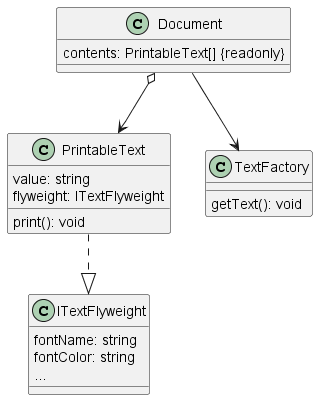
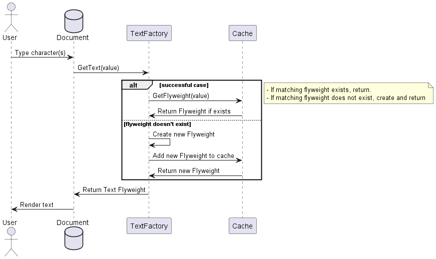

# Flyweight Design Pattern

## Overview
The Flyweight design pattern sets out to promote a flexible, object-oriented* solution to handling many objects of similar shape and/or structure. The pattern makes use of a factory for creating these similar objects with a consuming client using these flywieghts to increase object count scalability.

In order to understand how we gain benefits from the flyweight pattern, it's recommended you understand how TypeScript/JavaScript manage memory. See [TypeScript-Memory-Refresher](#typescript-memory-refresher) in the appendix for a quick refresher.

## Example Scenario
To demonstrate the pattern and the benefits it provides, consider a text editor. A text document might contain hundreds of thousands (or more) of characters, with any number of groups of different formats (such as rtf format codes). Each character value is small but the rendering character glyph, the font metadata, the spacing metadata, etc.. add up. Multiply that by millions and you'll quickly run out of memory.

Using the following (admittedly bad) implementation, you can see how quickly the memory ramps up as characters are added. This object has a string of variable size, a number, a color string of variable size, and an array of bytes. Now a new character is added, it also has a font string, size, color, etc.. Even if each of these characters use the same format, they are individually storing duplicate data between them.

```
class TextCharacter {
    value: string,
    fontName: string
    fontSize: number
    fontColor: string
    fontGlyph: byte[]
}
```

## Example Solution
To solve the problem of maintaining so many objects the class design needs to change. Similar to the normalization process in relational database design, we are going to "normalize" the data points such that shared information (extrinsic data) is extracted from the object and referenced by the object containing the unique data (intrinsic data). In the example above, the font name, size, color and byte array* are independent of the actual character. Thus they could be shared between characters. This means we have the following breakdowng:in each object instead of directly being stored.


```
class TextCharacter {
    // Implicit Data
    value: string,
    // Explicit Data as reference
    fontData: SomeTypeContainingFontInformation
}
```

The code example for this pattern takes this a step further and abstracts things into interfaces that can be further extended but the simplified example above describes utilizing a reference to avoid duplicated values in memory.

## Implementation Details


### Text Factory
This pattern implementation utilizes the Factory Design Pattern to provde a clean separation of object creation and object use. Understanding the Factory pattern is beneficial but not required to understand the Flyweight Pattern. The following sequence provides an overview of the steps used by the factory to generate and cache flyweight objects.



# Appendix
## TypeScript Memory Refresher
Flyweight works due to the concept of reference and value types and the distinction between the two is critical to understanding the benefits of the pattern. While this is focused on JavaScript/Typescript, it is applicable to many other languages. Note that this greatly simplifies things to get the idea across and isn't meant to be a deep dive.

### How Is Data Stored
Typescript utilizes two distinct memory patterns: a heap and a stack. Which one is used depends on what needs to be stored. Value types are always stored on the stack while reference types are stored in the heap.

### Value Types
All primitive datatypes are stored on the stack. Examples include number, string, boolean, null, undefined, etc.. For example, the following code leads to the following stack:

```
let myVar = 1
let myNextVar = myVar
```

| Stack         |
| --------------|
| myNextVar = 1 |
| myVar = 1     |


Now if we were to modify the new value, since we're using primitives and primitives are value types stored on the stack, we see that updating the new var doesn't update the existing despite the fact we set the new variable to the old one. This assignment, rather than pointing myNextVar to the stack reference of myVar, it takes the *value* of myVar and assigns it to myNextVar.

```
let myVar = 1
let myNextVar = myVar
++myNextVar
```

| Stack         |
| --------------|
| myNextVar = 2 |
| myVar = 1     |

The key takeaway here is that primitives are stored on the stack, and they are stored as values. Assigning one primitive to the value of another does not create any dependency or chain with the original variable

### Reference Types
Any non-primitive data type is treated as a reference type on the Heap. This means any custom object, function, array, and so on is stored by reference. The heap has keep a reference to the value in memory but the variable itself is maintained as a reference to the value rather than the value itself. Those who have written C before might recognize these objects as pointers.

```
let myObj = { id: 1 }
let myNewObj = myObj
```
| Heap               |
| -------------------|
| myNextVar = &myVar |
| myVar = { id: 1 }  | 

We're using an ampersand to indicate that the variable myNextVar is actually pointing to myVar which is pointing to a memory location holding ```{ id: 1 }```

This means when we make a modification on the new variable, it actually updates the original. This is key to why the flyweight pattern works: we aren't storing a value for each of these variable, but rather we're passing references around. With a similar example to above, if we modify the new variable, the Heap is updated as such:

```
let myObj = { id: 1 }
let myNewObj = myObj
myNewObj.id = 5
```
| Heap               |
| -------------------|
| myNextVar = &myVar |
| myVar = { id: 5 }  | 

Since myNextVar is a reference to myVar and myVar is a reference to the value { id: 1 }, when id is updated to 5 it actually updates the realized value of the original.